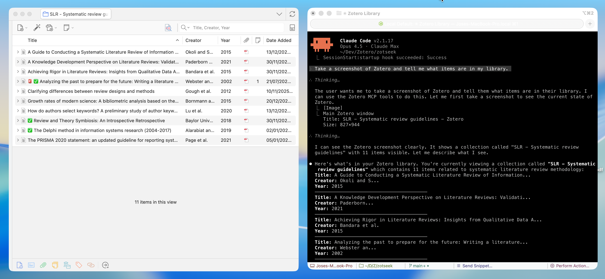

<div align="center">

# MCP Server Zotero Dev

**Give your AI assistant superpowers for Zotero plugin development**

[](LICENSE)
[](https://www.zotero.org)

[Architecture](ARCHITECTURE.md) · [Getting Started](#quick-start) · [Available Tools](#available-tools)



</div>

---

A **Model Context Protocol (MCP) server** that enables AI assistants like Claude, Cursor, and Windsurf to build, test, and debug [Zotero](https://www.zotero.org) 7/8 plugins. Screenshots, DOM state, debug logs, and JavaScript execution give the AI rich context to understand what's happening—and tools to help you fix it.

## ✨ Features

| Category | Capabilities |
|----------|-------------|
| 🎯 **UI Inspection** | Screenshots, DOM tree, element finding, computed styles |
| 💻 **JS Execution** | Run code in Zotero context, inspect APIs, test snippets |
| 🔧 **Build Tools** | Scaffold integration for build, serve, hot reload |
| 📋 **Logs & Errors** | Stream debug output, error console, watch for issues |
| 🗃️ **Database** | Read-only access to zotero.sqlite for debugging |
| 🔌 **Plugin Management** | Install, reload, list plugins |

---

## 🚀 Quick Start

### Prerequisites

- **Node.js** 20+ and npm
- **Zotero 7+** — Works on all Zotero 7 and 8 builds (release, beta, dev)
- For plugin development: [zotero-plugin-scaffold](https://github.com/windingwind/zotero-plugin-scaffold)

### 1. Install MCP Server

Use [install-mcp](https://www.npmjs.com/package/install-mcp) to add the server to your AI assistant:

```bash
npx -y install-mcp @introfini/mcp-server-zotero-dev --client claude-code
```

Supported clients: `claude-code`, `cursor`, `windsurf`, `vscode`, `cline`, `roo-cline`, `claude`, `zed`, `goose`, `warp`, `codex`

<details>
<summary><strong>Claude Code</strong></summary>

```bash
npx -y install-mcp @introfini/mcp-server-zotero-dev --client claude-code
```
</details>

<details>
<summary><strong>Cursor</strong></summary>

```bash
npx -y install-mcp @introfini/mcp-server-zotero-dev --client cursor
```
</details>

<details>
<summary><strong>VS Code / Copilot</strong></summary>

```bash
npx -y install-mcp @introfini/mcp-server-zotero-dev --client vscode
```
</details>

<details>
<summary><strong>Windsurf</strong></summary>

```bash
npx -y install-mcp @introfini/mcp-server-zotero-dev --client windsurf
```
</details>

<details>
<summary><strong>Manual Configuration</strong></summary>

Add to your MCP client config:

```json
{
  "mcpServers": {
    "zotero-dev": {
      "command": "npx",
      "args": ["-y", "@introfini/mcp-server-zotero-dev"],
      "env": {
        "ZOTERO_RDP_PORT": "6100"
      }
    }
  }
}
```
</details>

**Restart your AI assistant** after adding the configuration.

### 2. Install MCP Bridge Plugin in Zotero

Download [zotero-mcp-bridge.xpi](https://github.com/introfini/mcp-server-zotero-dev/releases/latest) and install:

1. In Zotero: **Tools → Plugins**
2. Click ⚙️ → **Install Plugin From File**
3. Select the downloaded `.xpi` file
4. **Restart Zotero**

> This lightweight plugin enables the Remote Debugging Protocol when Zotero starts. It only needs to be installed once and works on all Zotero 7+ builds (release, beta, and dev).

### 3. Start Developing!

Just open Zotero normally and ask your AI assistant:

> "Take a screenshot of Zotero and list installed plugins"

That's it! No special launch flags, no configuration. 🎉

---

## 🧰 Available Tools (26 total)

<details>
<summary><strong>UI Inspection</strong> — Screenshots, DOM, styles</summary>

| Tool | Description |
|------|-------------|
| `zotero_screenshot` | Capture window, element, or region screenshots |
| `zotero_inspect_element` | Find elements by CSS selector |
| `zotero_get_dom_tree` | Get DOM structure of a window/panel |
| `zotero_get_styles` | Get computed CSS styles for element |
| `zotero_list_windows` | List all open Zotero windows |

> **Screenshot Targets**: Main window, preferences, PDF reader, dialogs, or any element by selector. Use `highlightSelector` to add a red border before capture.

</details>

<details>
<summary><strong>JavaScript Execution</strong> — Run code in Zotero context</summary>

| Tool | Description |
|------|-------------|
| `zotero_execute_js` | Execute JavaScript in Zotero's privileged context. Auto-wraps code with top-level `return` statements in IIFE. |
| `zotero_inspect_object` | Explore Zotero APIs - list methods and properties of any object (e.g., `Zotero.Items`) |
| `zotero_open_preferences` | Open Zotero's settings window, optionally to a specific pane (built-in or plugin) |
| `zotero_search_prefs` | Search/discover preferences by pattern (e.g., find all prefs containing "debug") |
| `zotero_get_pref` | Get a preference value |
| `zotero_set_pref` | Set a preference value |

> **Examples**: `Zotero.Items.getAll(1)`, `Zotero.Prefs.get('export.quickCopy.setting')`, `ZoteroPane.getSelectedItems()`
>
> **Tip**: Use `zotero_inspect_object` to explore APIs before writing code. Use `zotero_search_prefs` to discover preference keys.

</details>

<details>
<summary><strong>Build & Scaffold</strong> — Integration with zotero-plugin-scaffold</summary>

| Tool | Description |
|------|-------------|
| `zotero_scaffold_build` | Build plugin (dev or production mode) |
| `zotero_scaffold_serve` | Start dev server with hot reload |
| `zotero_scaffold_lint` | Run ESLint on plugin source |
| `zotero_scaffold_typecheck` | Run TypeScript type checking |

</details>

<details>
<summary><strong>Logs & Debugging</strong> — Error console and debug output</summary>

| Tool | Description |
|------|-------------|
| `zotero_read_logs` | Read debug output (Zotero.debug) |
| `zotero_read_errors` | Read error console entries |
| `zotero_watch_logs` | Stream logs in real-time |
| `zotero_clear_logs` | Clear log buffer |

</details>

<details>
<summary><strong>Plugin Management</strong> — Install, reload, inspect</summary>

| Tool | Description |
|------|-------------|
| `zotero_plugin_reload` | Hot reload your dev plugin |
| `zotero_plugin_install` | Install plugin from XPI path |
| `zotero_plugin_list` | List installed plugins with version/status |

</details>

<details>
<summary><strong>Database Access</strong> — Read-only SQLite access</summary>

| Tool | Description |
|------|-------------|
| `zotero_db_query` | Execute SELECT query on zotero.sqlite |
| `zotero_db_schema` | Get table schema information |
| `zotero_db_stats` | Get database statistics (items, attachments, collections, size) |

> **Note**: Database access is read-only and requires Zotero to be closed, or uses a copy of the database.

</details>

---

## 🏗️ Architecture

```
┌─────────────────────────────────────────────────────────────────┐
│                        AI Assistant                             │
│                  (Claude, Cursor, Windsurf)                     │
└─────────────────────────┬───────────────────────────────────────┘
                          │ MCP Protocol (stdio)
                          ▼
┌─────────────────────────────────────────────────────────────────┐
│                  MCP Server (Node.js/TypeScript)                │
│  ┌──────────────┐  ┌──────────────┐  ┌──────────────────────┐   │
│  │   Scaffold   │  │     RDP      │  │      Database        │   │
│  │  Integration │  │    Client    │  │      Reader          │   │
│  └──────────────┘  └──────┬───────┘  └──────────────────────┘   │
└─────────────────────────────┼───────────────────────────────────┘
                              │ Firefox RDP (port 6100)
                              ▼
┌─────────────────────────────────────────────────────────────────┐
│                      Zotero Application                         │
│  ┌──────────────────────────────────────────────────────────┐   │
│  │            MCP Bridge for Zotero                         │   │
│  │         Starts DevToolsServer on launch                  │   │
│  └──────────────────────────────────────────────────────────┘   │
│  ┌──────────────────────────────────────────────────────────┐   │
│  │              Firefox DevTools Server (built-in)          │   │
│  │           JS Execution • DOM • Console • Screenshots     │   │
│  └──────────────────────────────────────────────────────────┘   │
│  ┌──────────────────────────────────────────────────────────┐   │
│  │                   Your Plugin (dev)                      │   │
│  └──────────────────────────────────────────────────────────┘   │
└─────────────────────────────────────────────────────────────────┘
```

**Why this approach?**

- ✅ **Lightweight plugin** — Just enables RDP, Firefox DevTools does the rest
- ✅ **Zero-config after install** — Just open Zotero normally, no special flags
- ✅ **Rich AI context** — Screenshots, DOM, and logs help the AI understand your plugin's state
- ✅ **Hot reload** — Integrates with zotero-plugin-scaffold for instant feedback
- ✅ **Full Zotero access** — Execute any Zotero API in the privileged context
- ✅ **Cross-platform** — Works on Linux, Windows, macOS

---

## 🔧 Environment Variables

| Variable | Description | Default |
|----------|-------------|---------|
| `ZOTERO_RDP_PORT` | Remote debugging port | `6100` |
| `ZOTERO_RDP_HOST` | Debugging host | `127.0.0.1` |
| `ZOTERO_DATA_DIR` | Path to Zotero data directory | Auto-detect |
| `ZOTERO_PROFILE_PATH` | Path to Zotero profile | Auto-detect |

---

## 📸 Screenshot Examples

```typescript
// Capture main Zotero window
await zotero_screenshot({ target: 'main-window' });

// Capture your plugin's panel with highlight
await zotero_screenshot({
  target: 'element',
  selector: '#my-plugin-panel',
  highlightSelector: '#my-plugin-button'
});

// Capture a specific window by ID (use zotero_list_windows to find IDs)
await zotero_screenshot({
  target: 'window',
  windowId: 12345
});

// Capture element after triggering UI action
await zotero_execute_js({ code: 'document.querySelector("#menu").click()' });
await zotero_screenshot({ target: 'element', selector: 'menupopup[state="open"]' });
```

---

## 🧑‍💻 Development

```bash
# Clone and install
git clone https://github.com/introfini/mcp-server-zotero-dev.git
cd mcp-server-zotero-dev
npm install

# Build everything
npm run build

# Build individual packages
npm run build -w mcp-server
npm run build -w zotero-plugin-mcp-rdp

# Run tests
npm test

# Development mode (watch)
npm run dev -w mcp-server
```

<details>
<summary><strong>Project Structure</strong></summary>

```
mcp-server-zotero-dev/
├── packages/
│   ├── mcp-server/               # MCP server (npm package)
│   │   ├── src/
│   │   │   ├── index.ts          # MCP server entry
│   │   │   ├── rdp/              # RDP client
│   │   │   ├── tools/            # Tool implementations
│   │   │   └── prompts/          # Slash commands
│   │   └── package.json
│   │
│   └── zotero-plugin-mcp-rdp/    # Tiny Zotero plugin (.xpi)
│       ├── src/
│       │   └── index.ts          # Starts RDP server
│       ├── addon/
│       │   └── manifest.json
│       └── package.json
│
├── docs/                         # Documentation
└── package.json                  # Monorepo root
```

</details>

---

## 📚 Resources

- **[Architecture & Technical Learnings](ARCHITECTURE.md)** — Deep dive into RDP protocol, actor hierarchy, and common pitfalls
- **[Zotero Plugin Development](https://www.zotero.org/support/dev/client_coding/plugin_development)** — Official docs
- **[Zotero 7 for Developers](https://www.zotero.org/support/dev/zotero_7_for_developers)** — Migration guide
- **[zotero-plugin-scaffold](https://github.com/windingwind/zotero-plugin-scaffold)** — Build tooling
- **[zotero-plugin-template](https://github.com/windingwind/zotero-plugin-template)** — Starter template
- **[zotero-plugin-toolkit](https://github.com/windingwind/zotero-plugin-toolkit)** — API helpers
- **[Firefox RDP Protocol](https://firefox-source-docs.mozilla.org/devtools/backend/protocol.html)** — Protocol docs

---

## 🤝 Contributing

Contributions are welcome! Please:

1. Follow existing code patterns
2. Add tests for new features
3. Update documentation
4. Ensure `npm test` and `npm run lint` pass

---

## 📄 License

MIT © [introfini](https://github.com/introfini)

---

## Acknowledgments

- Built for the [Zotero](https://www.zotero.org) plugin developer community
- Integrates with [zotero-plugin-scaffold](https://github.com/windingwind/zotero-plugin-scaffold) by [@windingwind](https://github.com/windingwind)
- Leverages Firefox DevTools RDP for reliable communication
